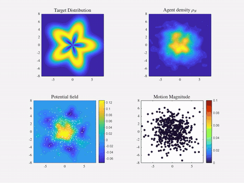
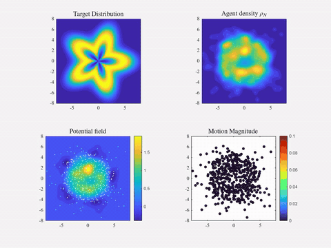
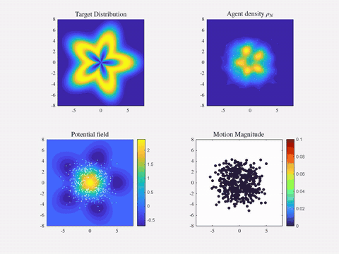

# Multiscale Distributed MPC for Optimal Transport

Code for the paper *Multiscale distributed MPC for Optimal Transport*.

**Abstract.** A large swarm tracks a moving target density. At the top level, each
agent computes its nominal velocity by solving a regularized optimal-transport
(Kantorovich) dual problem. The problem is approximated with compactly supported
kernels centred at the agents, and agents only exchange data with neighbours. At the
low level, each agent runs an MPC that tracks this nominal velocity under
control-affine dynamics and rejects an unknown wind, which it estimates from its own
motion. The paper proves a bounded distributional input-to-state stability result in
the 1-Wasserstein distance. The simulations use 500 agents and a rotating star-shaped
target.

## Videos

Each video has four panels: target density, agent density, potential field φ, and agent speeds.

| Distributed, regularized (ε > 0) | Distributed, unregularized (ε = 0) |
|---|---|
|  |  |

Without regularization the agents collapse into dense clusters and the commanded
speeds are much larger. With the L² regularization the swarm spreads over the target.

**Centralized variant (not in the paper).** Same method, but the potential φ is
written on a fixed grid of kernels covering the domain instead of kernels centred at
the agents. It is included only for comparison.



Full-resolution videos: `Distr-rOT/results/OT_Distr_Reg.avi`,
`Distr-rOT/results/OT_Distr_Unreg.avi` and `Centr-rOT/results/OT_Centr.avi`.

## Repository

| Folder | Contents |
|---|---|
| `Distr-rOT/` | **Method of the paper**: distributed planner (kernels centred at the agents), paper figure |
| `Centr-rOT/` | Centralized variant (field on a fixed grid), not in the paper |
| `MPC/` | Low-level MPC (`low_level_mpc_setup.m`, `low_level_mpc.m`) |
| `WINDS/` | Drift fields (Taylor–Green vortex, uniform wind) |
| `media/` | GIFs shown above |

## How to run

You need MATLAB with the Control System, Optimization and Statistics and Machine
Learning toolboxes. The sweep and figure scripts also use the Parallel Computing
Toolbox (`parfor`). Every script sets its own paths.

**Distributed method (paper):**

```matlab
cd Distr-rOT
parameters_w      % parameters (N = 500 agents, kernels, eps, target, ...)
main_w_final      % one run; saves the video to results/OT_Wendland.avi
```

In `main_w_final.m`, set `use_mpc = true` to use the low-level MPC. Then choose
`wind_model = 'taylor_green'` and `drift_mode = 'estimated'`, which estimates the wind
from the agent's own motion, as in the paper. The regularization ε is
`params.epsilon_reg` in `parameters_w.m`.

**Paper figure (Fig. 1):**

```matlab
cd Distr-rOT
paper_figure_w    % run_sims = false: redraws from results/paper_figure_results.mat
                  % run_sims = true:  re-runs all simulations (several hours, parallel)
```

**Centralized variant (not in the paper):**

```matlab
cd Centr-rOT
parameters_w
main_nodes
```
